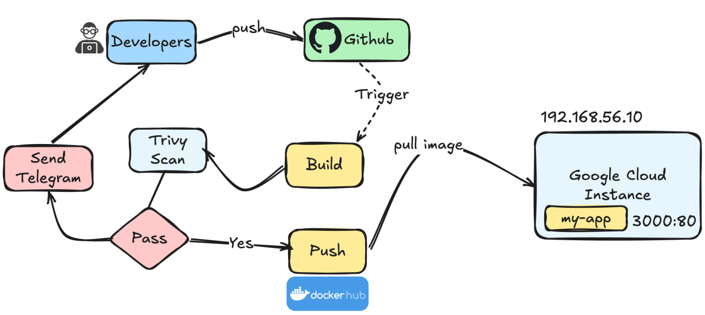

# Expense Tracker App - DevOps Documentation



## Overview

The Expense Tracker App is a containerized Node.js/Express application with a complete DevOps pipeline featuring Docker containerization, Docker Hub registry integration, automated CI/CD workflows, and security scanning. This document focuses on the DevOps infrastructure and deployment strategies.

---

## Architecture

### Technology Stack

- **Container Runtime**: Docker
- **Web Framework**: Express.js (Node.js v20)
- **Database**: MySQL
- **Reverse Proxy**: Nginx
- **CI/CD**: GitHub Actions
- **Container Registry**: Docker Hub
- **Security Scanning**: Trivy
- **Language**: JavaScript (ES Modules)

### High-Level Architecture

```
┌─────────────────────────────────────┐
│     GitHub Repository               │
│   (Master Branch Triggers)          │
└──────────────┬──────────────────────┘
               │
               ▼
┌─────────────────────────────────────┐
│   GitHub Actions CI/CD Pipeline     │
│  - Build Docker Image               │
│  - Security Scan (Trivy)            │
│  - Push to Docker Hub               │
└──────────────┬──────────────────────┘
               │
               ▼
┌─────────────────────────────────────┐
│   Docker Hub Registry               │
│   (Container Image Storage)         │
└──────────────┬──────────────────────┘
               │
               ▼
┌─────────────────────────────────────┐
│   Production Environment            │
│  - Docker Container                 │
│  - Nginx (Reverse Proxy)            │
│  - MySQL Database                   │
└─────────────────────────────────────┘
```

---

## Containerization Strategy

### Multi-Stage Dockerfile

The project uses a **production-optimized Dockerfile** with a single stage:

```dockerfile
FROM node:20-alpine AS production
WORKDIR /app
COPY package*.json ./
RUN npm ci --omit=dev
COPY src ./src
EXPOSE 3000
ENTRYPOINT ["node", "src/index.js"]
```

**Key Features:**
- **Alpine Base Image**: Lightweight (~150MB) Node.js runtime
- **npm ci (Clean Install)**: Reproducible, production-grade dependency installation
- **--omit=dev Flag**: Excludes development dependencies, reducing image size
- **Port 3000**: Application listening port
- **Explicit ENTRYPOINT**: Direct node execution without shell overhead

### Image Optimization

- **Alpine Linux**: Reduces base image size from ~1GB (standard) to ~150MB
- **Clean Install (npm ci)**: Ensures consistent, lock-file-based installations
- **Production Dependencies Only**: Excludes dev tools and test frameworks
- **Minimal Layers**: Single-stage build reduces image complexity

---

## Web Server Configuration

### Nginx Configuration

Nginx serves as the reverse proxy and static file server:

```nginx
server {
    listen 80;
    listen [::]:80;
    server_name localhost;
    
    location / {
        root   /usr/share/nginx/html;
        index  index.html index.htm;
        try_files $uri $uri/ /index.html;
    }
    
    error_page   500 502 503 504  /50x.html;
    location = /50x.html {
        root   /usr/share/nginx/html;
    }
}
```

**Configuration Features:**
- **Dual Stack Support**: IPv4 and IPv6 listening
- **SPA Fallback**: `try_files` directive routes unmatched paths to index.html
- **Custom Error Pages**: Graceful error handling for 5xx responses
- **Static File Serving**: Optimized delivery of frontend assets

---

## CI/CD Pipeline

### GitHub Actions Workflow

**Trigger**: Automatic on push to `master` branch

**Pipeline Stages**:

#### 1. Code Checkout & SHA Tagging
```yaml
- Checkout code
- Extract first 8 characters of commit SHA for image tagging
- Enables commit-based traceability
```

#### 2. Docker Hub Authentication
```yaml
- Authenticate with Docker Hub using secrets
- Enables push to private/public repositories
```

#### 3. Build & Tag
```bash
docker build -t ${{ secrets.DOCKER_USERNAME }}/express-js-dev-pipeline:$TAG .
```

#### 4. Security Scanning with Trivy
**Two-phase approach:**

a) **Informational Table Output**
- Format: Human-readable table
- Exit Code: 0 (non-blocking)
- Severity Levels: CRITICAL, HIGH, MEDIUM
- Scan Types: OS vulnerabilities, Library vulnerabilities

b) **Structured Security Reports**
- **JSON Report**: Machine-readable format for parsing/alerting
- **SARIF Report**: GitHub Security tab integration for visualization
- Both scan for CRITICAL and HIGH severity vulnerabilities

#### 5. Vulnerability Analysis & Reporting
- Count CRITICAL and HIGH vulnerabilities
- Extract top 10 issues with details:
  - Vulnerability ID
  - Package Name
  - Severity Level
- Prepare for notifications (Telegram integration ready)

### Environment & Secrets Management

**Required GitHub Secrets**:
- `DOCKER_USERNAME`: Docker Hub username
- `DOCKERHUB_PASSWORD`: Docker Hub authentication token

**Environment Variables**:
- `DOCKER_IMAGE_NAME`: `express-js-dev-pipeline`
- `TAG`: Commit SHA (first 8 chars)

**Permissions**:
- `contents: read` - Repository access
- `security-events: write` - Security tab write access
- `actions: read` - Actions workflow tracking

---

## Deployment Processes

### Local Development

1. **Install Dependencies**
   ```bash
   npm install
   ```

2. **Start Application**
   ```bash
   node index.js
   ```

3. **Environment Setup**
   Create `.env` file:
   ```
   PORT=3000
   DB_HOST=localhost
   DB_USER=root
   DB_PASSWORD=password
   DB_NAME=expense_tracker
   JWT_SECRET=your_secret_key
   ```

### Docker Deployment

#### Build Image Locally
```bash
docker build -t expense-tracker:latest .
```

#### Run Container
```bash
docker run -d \
  -p 3000:3000 \
  -e DB_HOST=mysql_host \
  -e DB_USER=root \
  -e DB_PASSWORD=password \
  -e JWT_SECRET=secret \
  --name expense-tracker \
  expense-tracker:latest
```

#### Environment Variables at Runtime
- `PORT`: Application port (default: 3000)
- `DB_HOST`: MySQL hostname
- `DB_USER`: Database username
- `DB_PASSWORD`: Database password
- `DB_NAME`: Database name
- `JWT_SECRET`: Token signing key

---

## Database Integration

### MySQL Connectivity

Located in [src/db/dbConnect.js](src/db/dbConnect.js), the application:
- Establishes connection pools for efficient resource management
- Validates connectivity on startup
- Supports connection pooling for concurrent requests

**Connection Parameters**:
```javascript
{
  host: process.env.DB_HOST,
  user: process.env.DB_USER,
  password: process.env.DB_PASSWORD,
  database: process.env.DB_NAME
}
```

---

## Application Structure

### API Endpoints

**Authentication** ([src/routes/authRoutes.js](src/routes/authRoutes.js)):
- User registration
- Login with JWT token generation
- Password hashing with bcrypt

**User Management** ([src/routes/userRoutes.js](src/routes/userRoutes.js)):
- User profile operations
- Token validation middleware

**Expense Tracking** ([src/routes/expenseRoute.js](src/routes/expenseRoute.js)):
- CRUD operations for expenses
- File upload handling with multer

### Middleware & Utilities

- **JWT Validation** ([src/utils/jwt_validate.js](src/utils/jwt_validate.js)): Token authentication
- **Password Security** ([src/utils/verify_password.js](src/utils/verify_password.js)): Bcrypt verification
- **Image Handling** ([src/utils/image_handler.js](src/utils/image_handler.js)): Multer-based file uploads
- **Token Generation** ([src/utils/generate_token.js](src/utils/generate_token.js)): JWT creation

---

## Security Practices

### Container Security
1. **Alpine Base Image**: Minimal attack surface
2. **Non-root Processes**: Reduced privilege escalation risk
3. **Trivy Vulnerability Scanning**: Automated security checks
4. **SHA-based Image Tagging**: Immutable release tracking

### Application Security
1. **JWT Authentication**: Token-based request validation
2. **Bcrypt Hashing**: Salted password storage
3. **Environment Variables**: Sensitive data externalization
4. **.gitignore Protection**: Excludes node_modules, .env, test files

### Network Security
1. **Port Exposure**: Only port 80/443 exposed via Nginx
2. **Reverse Proxy**: Application not directly exposed
3. **TLS Ready**: Nginx configuration supports SSL/TLS

---

## Performance Considerations

### Image Optimization
- Alpine Linux: ~5x smaller than standard Node.js images
- Production dependencies only: Reduces runtime bloat
- Layer caching: Leverages Docker build cache for faster rebuilds

### Runtime Efficiency
- Node.js v20: Latest LTS with performance improvements
- Connection pooling: Efficient database resource usage
- Nginx reverse proxy: Static file acceleration

---

## Monitoring & Logging

### Health Checks
- Application listens on port 3000
- Database connectivity verified on startup
- Test endpoint: `GET /` (protected by JWT)

### Logging
- Console output for deployment verification
- Database connection logs
- Application startup confirmation

### Security Monitoring
- Trivy scans: Vulnerability detection
- GitHub Security tab: Integrated vulnerability tracking
- SARIF reports: Structured security data

---

## Dependencies

| Package | Version | Purpose |
|---------|---------|---------|
| express | ^4.19.2 | Web framework |
| mysql | ^2.18.1 | Database driver |
| bcrypt | ^5.1.1 | Password hashing |
| jsonwebtoken | ^9.0.2 | JWT authentication |
| multer | ^1.4.5-lts.1 | File upload handling |
| dotenv | ^16.4.5 | Environment configuration |

---

## Getting Started

1. **Clone Repository**
   ```bash
   git clone <repository-url>
   cd Expense-Tracker-App
   ```

2. **Setup Environment**
   ```bash
   cp .env.example .env
   # Edit .env with your configuration
   ```

3. **Deploy with Docker**
   ```bash
   docker build -t expense-tracker .
   docker run -p 3000:3000 \
     -e DB_HOST=your_db_host \
     -e DB_USER=your_user \
     -e DB_PASSWORD=your_pass \
     -e JWT_SECRET=your_secret \
     expense-tracker
   ```

4. **Verify Deployment**
   ```bash
   curl http://localhost:3000
   ```

---

## Troubleshooting

| Issue | Solution |
|-------|----------|
| Container fails to start | Check environment variables are set correctly |
| Database connection fails | Verify DB_HOST, DB_USER, DB_PASSWORD in .env |
| Port 3000 already in use | Change port mapping: `-p 8000:3000` |
| Image build fails | Clear Docker cache: `docker system prune -a` |
| Security scan failures | Review trivy-report.json for vulnerability details |

---

## Future Enhancements

- [ ] Kubernetes deployment manifests
- [ ] Docker Compose for multi-container orchestration
- [ ] Automated database migrations
- [ ] APM integration (New Relic, DataDog)
- [ ] Load testing & performance benchmarks
- [ ] Blue-green deployment strategy
- [ ] Container registry scanning integration

---

## Contact & Support

For DevOps infrastructure questions or contributions, please open an issue in the repository.
